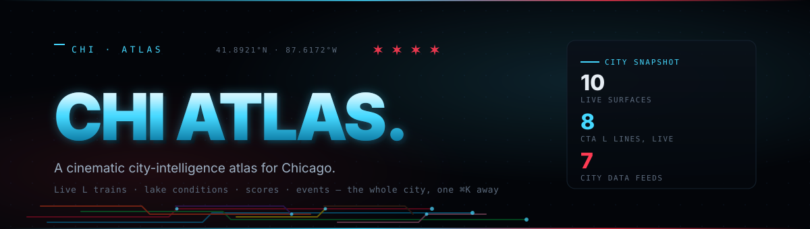
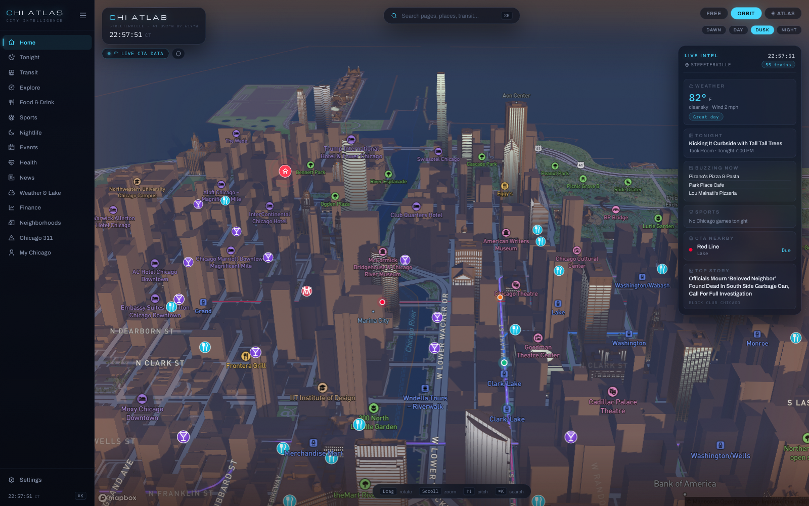
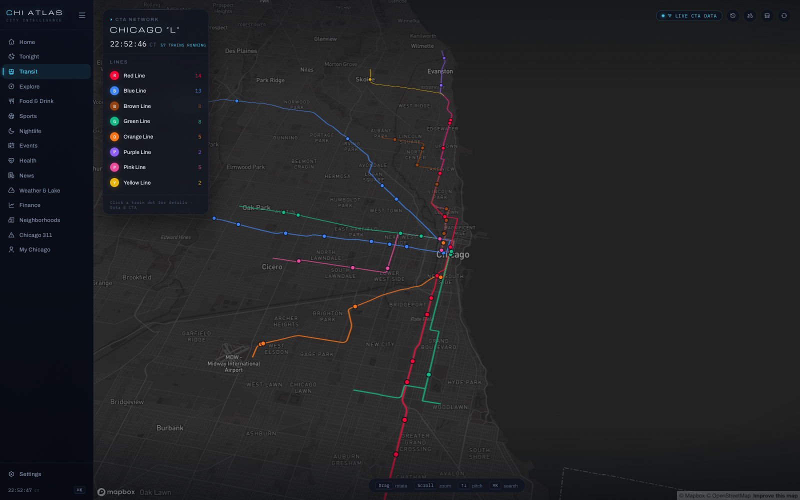
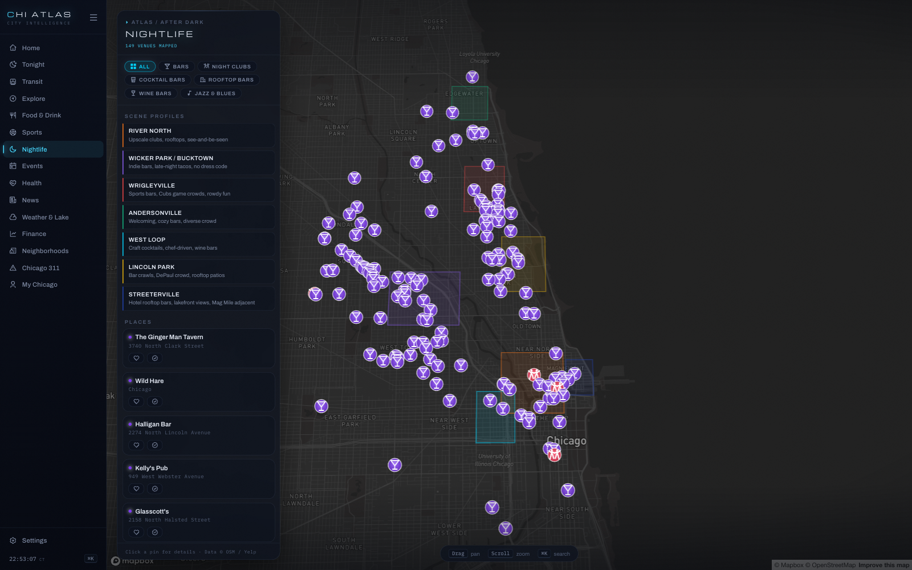
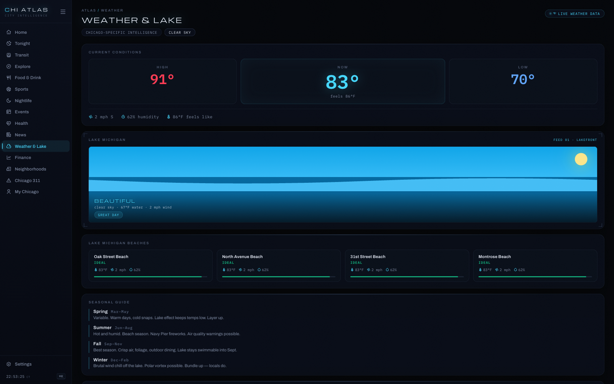
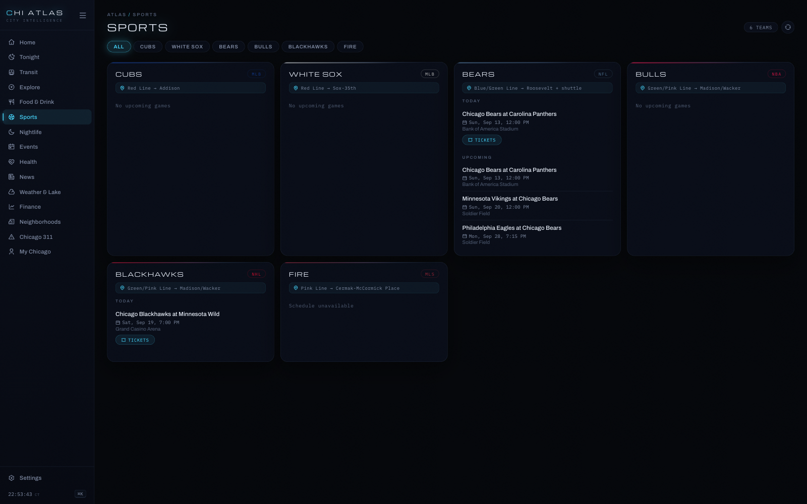

<div align="center">



&nbsp;


<a href="LICENSE"></a>
<br/>


&nbsp;

<a href="#quickstart"><kbd> &nbsp; <strong>Quickstart</strong> &nbsp; </kbd></a> &nbsp;
<a href="#the-ten-surfaces"><kbd> &nbsp; <strong>The ten surfaces</strong> &nbsp; </kbd></a> &nbsp;
<a href="#k--the-command-palette"><kbd> &nbsp; <strong>⌘K palette</strong> &nbsp; </kbd></a> &nbsp;
<a href="#live-data"><kbd> &nbsp; <strong>Live data</strong> &nbsp; </kbd></a> &nbsp;
<a href="#under-the-hood"><kbd> &nbsp; <strong>Under the hood</strong> &nbsp; </kbd></a> &nbsp;
<a href="#deployment"><kbd> &nbsp; <strong>Deployment</strong> &nbsp; </kbd></a>

</div>

---

<p align="center">
  
</p>

<p align="center"><em>Dusk over Streeterville. Every dot is live: trains on the L, tonight's bars, the lake at the horizon — and the IntelFeed keeping score on the right.</em></p>

---

## What this is

**CHI ATLAS is a mission-control room for one city.** A dark, cinematic HUD over live Chicago data — glass panels, neon transit glows, mono clocks — built around a 3D Mapbox map that opens with a fly-in over Streeterville and never really sits still. L trains crawl the map in their real positions. Scores refresh while the game is on. The lake tells you whether it's a beach day. Everything is reachable from one ⌘K palette.

It is the successor to [chicago-explore](https://github.com/AllStreets/chicago-explore) — same feature set, fully overhauled design: one visual language (near-black canvas, electric cyan, Chicago red), one type system (Michroma for display, Archivo for UI, IBM Plex Mono for anything that ticks), and film grain over all of it.

> *The city is already broadcasting. This is the receiver.*

```
  the atlas
  ├─ home ............ 3D dusk-lit map — live L dots, stadium pins, IntelFeed
  ├─ transit ......... all 8 L lines + a 24h time machine (1×–240× replay)
  ├─ explore ......... curated landmarks by category, with an AI guide
  ├─ nightlife ....... bars to jazz rooms across 7 neighborhood scenes
  ├─ food ............ OSM-powered map — pizza, sushi, tacos, brunch
  ├─ sports .......... Cubs · Sox · Bears · Bulls · Blackhawks · Fire, live
  ├─ events .......... Ticketmaster listings, color-coded by type
  ├─ weather ......... conditions + an animated Lake Michigan (8 states)
  ├─ neighborhoods ... character, stats, vibe tags, an AI live-in advisor
  └─ my chicago ...... every place you saved or set foot in
```

---

## The ten surfaces

| Route | Surface | What it does |
|---|---|---|
| `/` | **Home** | Cinematic 3D map (Mapbox Standard) with intro fly-in, Orbit mode, chrome-free **Atlas Mode**, and dawn / day / dusk / night lighting that defaults to Chicago solar time. Live CTA train dots, official team-logo stadium pins, food and nightlife icons, floating glass IntelFeed. |
| `/transit` | **Transit** | Tokyo-Metro-style HUD — full-bleed pitched map, glass panel for all **8 CTA L lines** with live per-line counts, animated train positions, Divvy stations, bus overlay, and a **time machine** that replays the last 24h of train movement with a scrubber. |
| `/explore` | **Explore** | Curated landmarks — architecture, culture, nature, hidden — with an AI guide chat. |
| `/nightlife` | **Nightlife** | Bars, clubs, cocktail and rooftop bars, wine bars, jazz venues, plus profiles for 7 nightlife neighborhoods, Streeterville included. |
| `/food` | **Food & Drink** | OSM-powered restaurant map with cuisine filters — restaurants, bars, cafes, pizza, sushi, tacos, brunch. |
| `/sports` | **Sports** | All six teams — live scores refreshing every 90s, today's games, upcoming schedule. |
| `/events` | **Events** | Ticketmaster listings, color-coded by type with filter tabs. |
| `/weather` | **Weather & Lake** | HIGH / NOW / LOW tiles and an animated Lake Michigan scene with 8 weather states. |
| `/neighborhoods` | **Neighborhoods** | Per-neighborhood character, stats, vibe tags, AI brief, and an AI live-in advisor. |
| `/me` | **My Chicago** | Saved favorites and been-there places, collected from Food, Nightlife, and Explore. |

<table>
<tr>
<td width="50%"></td>
<td width="50%"></td>
</tr>
<tr>
<td><em>Transit — eight lines, live counts, and a 24-hour time machine.</em></td>
<td><em>Nightlife — the whole scene, one neighborhood at a time.</em></td>
</tr>
<tr>
<td width="50%"></td>
<td width="50%"></td>
</tr>
<tr>
<td><em>Weather &amp; Lake — is it a beach day? The lake scene answers first.</em></td>
<td><em>Sports — six teams, live scores, next games.</em></td>
</tr>
</table>

---

## ⌘K — the command palette

One keystroke from anywhere:

- **Go** — jump between all ten surfaces.
- **Find** — deep search across places, L stations, neighborhoods, and events; picking a result flies the map to it.
- **Ask ATLAS** — an AI concierge riding the same palette.

Map surfaces add their own physical controls: drag to rotate, scroll to zoom, `↑` `↓` to pitch, plus Orbit and Atlas ambient modes — with kbd-hint bars on every map page so you never have to remember any of it.

---

## Quickstart

```bash
git clone https://github.com/AllStreets/chi.git
cd chi
```

**Backend** (terminal one):

```bash
cd backend
npm install
cp .env.example .env    # fill in keys — see Environment variables
node server.js          # http://localhost:3001
```

**Frontend** (terminal two):

```bash
cd frontend
npm install
npm run dev             # http://localhost:5173
```

Both must run simultaneously. Without API keys the app degrades gracefully — maps show a placeholder and data sections say "add key to enable" instead of breaking.

---

## Live data

Seven feeds, one SQLite cache between them and the rate limits:

| Feed | Source | Key | Cached |
|---|---|---|---|
| Live L train positions | CTA Train Tracker | required | live poll, animated between updates |
| Weather + lake conditions | OpenWeatherMap | required | per-request |
| Food · drink · nightlife places | OpenStreetMap / Overpass | none | 6 hours |
| Events | Ticketmaster Discovery | required | per-request |
| Scores + schedules | ESPN public scoreboard | none | 90 seconds live · 1 hour schedule |
| Maps + 3D buildings | Mapbox GL (Standard style) | token (50k loads/mo free) | — |
| AI guide · advisor · concierge | OpenAI | required (pay per token) | streams |

Divvy bike stations ride along on the transit map from the public GBFS feed — no key needed. On the frontend, place data also lives in a module-level cache that survives navigation, so Food and Nightlife load instantly after the homepage prefetches them.

---

## Environment variables

**Backend** — `backend/.env`:

| Variable | Required | Description |
|---|---|---|
| `OPENWEATHER_KEY` | Yes | OpenWeatherMap key — [openweathermap.org](https://openweathermap.org) |
| `OPENWEATHER_API_KEY` | Yes | Same key as above (two routes read different names) |
| `OPENAI_API_KEY` | Yes | OpenAI key — powers the AI streaming — [platform.openai.com](https://platform.openai.com) |
| `TICKETMASTER_KEY` | Yes | Ticketmaster Discovery — [developer.ticketmaster.com](https://developer.ticketmaster.com) |
| `CTA_API_KEY` | Yes | CTA Train Tracker — [transitchicago.com/developers](https://www.transitchicago.com/developers/) |
| `FRONTEND_URL` | No | Extra browser origin allowed through CORS. Not needed on the combined Vercel deployment (same origin). |
| `CRON_SECRET` | No | Required only for the `/api/cron/*` endpoints in production |
| `SQLITE_PATH` | No | Overrides the DB path — defaults to `/tmp/chicago.db` on Vercel, `backend/chicago.db` locally |
| `PORT` | No | Leave unset — the host injects it |

**Frontend** — `frontend/.env`:

| Variable | Required | Description |
|---|---|---|
| `VITE_MAPBOX_TOKEN` | Yes | Mapbox public token — [mapbox.com](https://mapbox.com) |
| `VITE_API_URL` | No | Leave unset — the SPA calls `/api` on its own origin, and falls back to `http://localhost:3001` in dev. Set it only if the API is hosted separately. |

---

## Under the hood

```
chi/
├─ backend/                  Express 5 · Node 18+
│  ├─ routes/                one file per feed — cta, weather, lake, sports,
│  │                         events, yelp (OSM), divvy, neighborhoods, ai, me
│  ├─ db.js                  SQLite — API cache + favorites/visited tables
│  ├─ server.js              app entry
│  └─ tests/                 Jest + Supertest
│
├─ frontend/                 React 19 · Vite · React Router v7
│  ├─ src/pages/             the ten surfaces
│  ├─ src/components/        IntelFeed · Sidebar · MapPlaceholder
│  ├─ src/hooks/             useCTA · useWeather · useYelp · useHomeFeed ·
│  │                         useMe · useMidnightRefresh
│  ├─ src/utils/mapIcons.js  shared 2× HiDPI Mapbox pin factory
│  ├─ src/data/ctaRoutes.js  CTA line geometry + colors
│  └─ src/styles/global.css  design tokens · dark theme · film grain
│
├─ vercel.json               two services (Vite SPA + Express API), one domain
└─ DEPLOYMENT.md             deploying to Vercel, step by step
```

**The design language** — canvas `#030509` near-black, `#45d8ff` electric cyan, `#ff3b53` Chicago red. Glass panels with backdrop blur and hairline borders, vignettes on map pages, film grain over everything. Michroma / Archivo / IBM Plex Mono. Icons are Remix (react-icons) — **no emojis, anywhere**. Installable PWA with push alerts for games, severe weather, lake days, and L delays. Full spec: [docs/superpowers/specs/2026-07-03-chi-atlas-overhaul-design.md](./docs/superpowers/specs/2026-07-03-chi-atlas-overhaul-design.md).

**Testing:**

```bash
cd backend  && npm test          # Jest + Supertest
cd frontend && npx vitest run    # Vitest + React Testing Library
```

---

## Deployment

One Vercel project, two services — the Vite SPA and the Express API behind a
single domain, so the frontend calls `/api` on its own origin. `vercel.json`
carries the whole configuration:

```bash
vercel --prod
```

[DEPLOYMENT.md](./DEPLOYMENT.md) walks the whole path — environment variables,
the Vercel Cron jobs that replace the in-process timers, and the one real
caveat: `/tmp` storage is ephemeral, so saved places and push subscriptions
need a durable database before they survive a cold start.

---

<div align="center">

**MIT** © 2026 [Connor Evans](https://github.com/AllStreets) — see [LICENSE](LICENSE)

Built in Streeterville — pointed at the whole city.

<sub>Four stars on the flag. Eight lines on the map.</sub>

</div>
